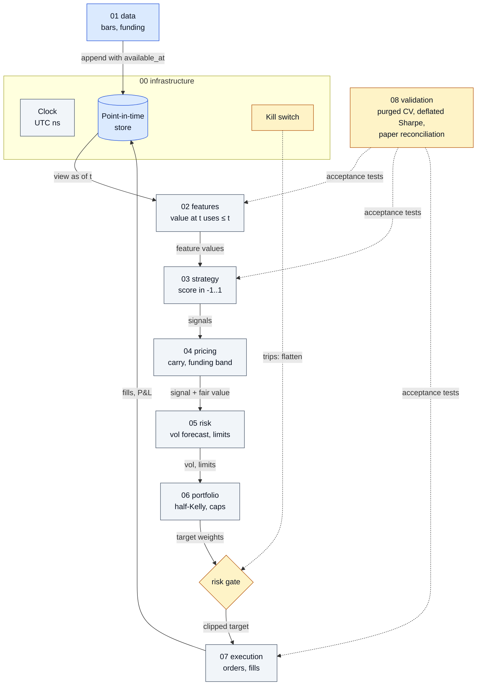

# Crypto Desk Blueprint
[](https://github.com/oscar-chw/crypto-desk-blueprint/actions/workflows/ci.yml) [](https://github.com/oscar-chw/crypto-desk-blueprint/actions/workflows/lint.yml) [](LICENSE)

A template that a human or an AI agent follows to build a crypto trading desk from scratch: typed stage
interfaces, tested building blocks, conformance tests that each have a caught mutant, a scaffold for new
implementations, and short docs that say why each rule exists. Its worked example is a separate repo,
[crypto-trading-pipeline](https://github.com/oscar-chw/crypto-trading-pipeline).

Where in the code: contracts in [`pipeline/protocols.py`](pipeline/protocols.py), building blocks in
[`pipeline/`](pipeline), acceptance tests in [`conformance/`](conformance), the reasoning in
[`blueprint/`](blueprint).



## Why this exists

A trading desk fails in quiet ways: a feature that peeks at the future, a backtest that fills for free, a
risk limit that only logs. Writing the pieces is the easy part; knowing when a piece is correct is hard,
and an AI agent building one has no instinct for it. This repo makes "correct" a command that can fail:
each stage has a contract and a conformance suite, and a stage is done when its suite passes.

## Approach

- **Nine stages**, 00 to 08: infrastructure, data, features, strategy, pricing, risk, portfolio,
  execution, validation. Each has a typed `Protocol` in `pipeline/protocols.py`.
- **Building blocks** in `pipeline/`: clock, point-in-time store, costs, purged cross-validation,
  pricing, risk engine with kill switch, sizing, statistics. Unit-tested in `tests/`.
- **Conformance suites** in `conformance/stages/`, one per stage, run against any implementation module.
- **Caught mutants** in `conformance/mutants/`: each is a copy of the toy broken in one specific way, and
  the mutant suite fails if any conformance test does not catch its mutant.
- **Scaffold**: `make new-<stage> name=X` creates a stub that reuses the toy for every other stage, so it
  is a complete implementation from the first minute and its own suite fails until you implement it.
- **Docs**: [blueprint/FOUNDATIONS.md](blueprint/FOUNDATIONS.md) holds the ideas every stage rests on;
  [blueprint/README.md](blueprint/README.md) indexes the stage files; [AGENTS.md](AGENTS.md) is the
  working protocol for an AI agent.

## Results

What is verified today, by command:

| Claim | Command | Evidence |
|---|---|---|
| 9 stages each have a protocol and a conformance suite | `make conformance` | [conformance/stages](conformance/stages) |
| 20 deliberately broken implementations are each caught by the suite | `make mutants` | [conformance/mutants](conformance/mutants) |
| Building blocks behave as specified | `pytest tests` | [tests/test_blocks.py](tests/test_blocks.py) |
| An offline toy runs end to end | `bash scripts/demo.sh` | [scripts/demo.py](scripts/demo.py) |
| Lint and tests pass together | `bash scripts/check.sh` | [ci.yml](.github/workflows/ci.yml) |

The experiments that would back each design rule are specified in
[blueprint/EVIDENCE.md](blueprint/EVIDENCE.md) and have not been run.

## Quick start

```bash
pip install -e ".[dev]"            # Python 3.11+
make test                          # ruff (E9,F) + unit tests + conformance + mutants
bash scripts/demo.sh               # offline toy: data to execution, prints a short summary
make new-strategy name=X           # scaffold implementations/X, then make it pass its suite
make conformance impl=implementations.X
```

You should see all tests pass and the demo print its step, order and breach counts.

## Project structure

```
blueprint/     why: FOUNDATIONS.md, one file per stage (rules, failure modes, sources), EVIDENCE.md
pipeline/      contracts (protocols.py) and shared building blocks
conformance/   stage suites, the toy implementation, and the mutants that prove the suites can fail
tests/         unit tests of the building blocks
experiments/   specified evidence experiments (not yet implemented)
scripts/       new_stage.py scaffold, check.sh, demo.sh
```

## Design decisions and trade-offs

- **Contracts as Protocols, not base classes.** Any object with the right methods conforms, so an
  implementation can wrap an existing library. The cost is that conformance is checked by tests, not by
  the type system alone.
- **Conformance suite is the definition of done.** It cannot be edited in the same change as the code it
  judges. This slows a quick fix and prevents the failure where the test is bent to fit the code.
- **Mutants prove the tests can fail.** A test no mutant can fail proves nothing. The cost is one small file per
  mutant, which keeps the suite honest as it grows.
- **Toy implementation for every stage.** A scaffolded stage is complete from minute one. The toy
  strategy is a placeholder and makes no claim about returns.
- **Paper mode by default.** Nothing here touches a live endpoint; [AGENTS.md](AGENTS.md) lists the
  actions an agent must hand to a human.
- **Cited, not asserted.** Stage files cite the author, year, title and venue of their sources.

## Limits

- The evidence experiments (EXP-xx) are specified, not yet run; no design rule here is backed by a
  measured result yet.
- The toy strategy is a placeholder; this repo makes no claim that any strategy makes money.
- Only a paper venue exists; a live exchange adapter is not included.
- Conformance covers the contracts listed in the stage files, not every way a desk can fail.
- Source citations give author, year, title and venue only; check the originals before relying on them.

## What I learned

- A test is only worth keeping once a deliberately broken implementation has been shown to fail it.
- Writing "done" as a command makes it possible to hand a stage to an AI agent and check the result.
- Keeping the reasons (blueprint) apart from the contracts (code) keeps both short.

## Credits and licence

MIT licence, see [LICENSE](LICENSE). The worked example is
[crypto-trading-pipeline](https://github.com/oscar-chw/crypto-trading-pipeline). Sources are cited in
`blueprint/`. Implemented with AI coding agents under Oscar's design and review.
