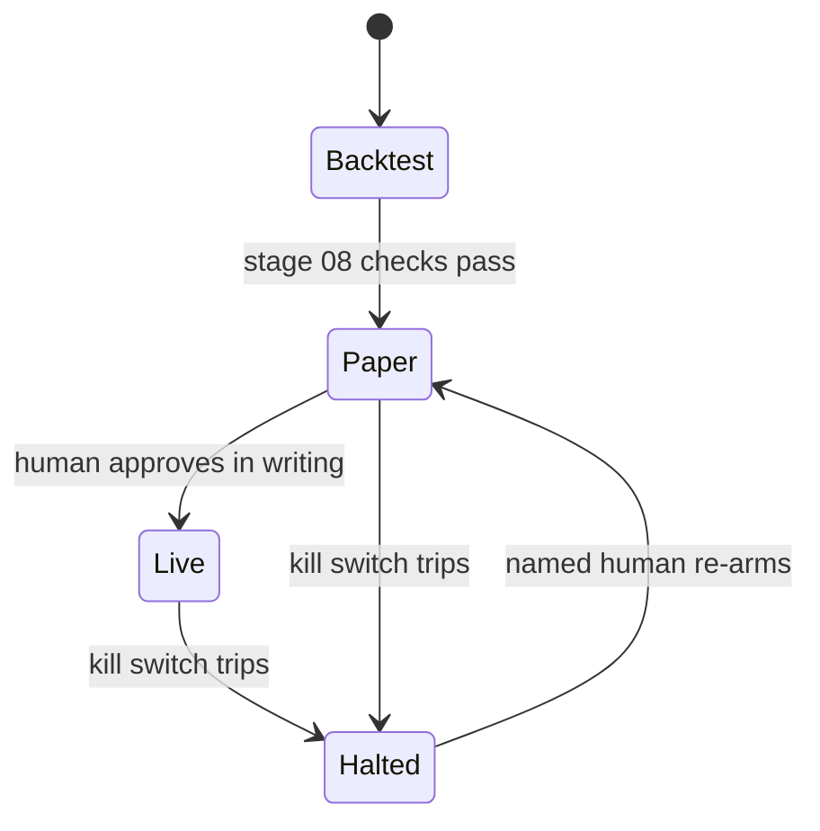

# 00 Infrastructure

## In one paragraph
Before any trading idea, the system needs plumbing it can trust: one clock, one config file, secrets kept
out of the code, logs you can replay, alerts that reach a person, and a big red button that stops trading.
The same code must run a backtest, a paper account and a live account, switching only the clock and the
venue. Live trading is a human decision, never a default.

## Purpose
Give every later stage a clock, a point-in-time store, configuration, secrets, logs, alerts, a kill switch
and three run modes (backtest, paper, live) that share one code path.

## Design rules
1. **All time is UTC nanoseconds (int).** Time zones and daylight saving create duplicate or missing hours; an int cannot.
2. **Nothing reads the wall clock directly; it asks a `Clock`.** Then backtest and live differ only in the clock object, so a backtest cannot see the future through `now()`.
3. **Every external record carries `available_at`.** Look-ahead is judged against when you could know a fact, not when it happened.
4. **Raw data is append-only; derived data is rebuildable.** A correction is a new record, so any past decision can be replayed exactly.
5. **One config file, validated into a frozen dataclass at start-up; unknown keys are an error.** A typo in a limit name must stop the process, not silently use a default.
6. **Secrets come from the environment or the OS keychain, never from the repo or logs.** Trading keys are trade-only and IP-restricted; withdrawal rights are never granted.
7. **Logs are structured JSON lines with the client order id on every order event.** You will debug from logs at 3 a.m. UTC; grep must work.
8. **The kill switch latches and only a named human re-arms it.** Automatic re-arming turns a stop into a pause and the same fault trips again with less capital.
9. **Alert on silence, not only on errors.** A dead feed raises no exception; a heartbeat older than three bar intervals pages someone.
10. **Paper trading lasts at least 30 days and 50 round trips, whichever is later, before any live request.** That covers several funding cycles, weekends and usually one volatile episode; lengthen it for slower strategies.

## Interface
[`pipeline/clock.py`](../pipeline/clock.py) (`Clock`, `SimClock`, `WallClock`),
[`pipeline/store.py`](../pipeline/store.py) (`PointInTimeStore`, `LookAheadError`),
[`pipeline/risk.py`](../pipeline/risk.py) (`KillSwitch`). Suite: [`test_infra.py`](../conformance/stages/test_infra.py).

Where in the code: `pipeline/risk.py` (`KillSwitch`); modes are a config value the human sets.

## Crypto specifics
- Markets never close: there is no overnight window for maintenance, so deploys must be rolling or flat-first.
- Venues go down or degrade (maintenance, overload in crashes); treat "venue unreachable" as a normal state with its own alert.
- API rate limits differ per venue and per endpoint; a client that ignores them gets banned at the worst moment.
- Use the venue's testnet for paper mode where it exists, and a local paper venue fed by live data otherwise.

## Common failure modes
- **Local-time bars**: a missing or doubled hour at a daylight-saving change in one market's data.
- **Backtest and live code diverge**: live trades differ from replayed backtest trades on the same data.
- **Silent feed death**: positions held with stale prices, no error in the log.
- **Self-re-arming stop**: repeated trips at the same fault, each with a smaller account.
- **Key with withdrawal rights on a server**: one breach empties the account.

## Acceptance tests
| id | input -> expected | mutant it kills |
|---|---|---|
| AT-00-1 | clock at 0, advance 5 -> 5; advance -1 or set 3 -> ValueError | `clock_goes_back` |
| AT-00-2 | record published at 12; view as of 11 sees nothing; read to 20 -> `LookAheadError` | `store_no_guard` |
| AT-00-3 | value 1 published at 12, correction 2 at 20 -> view(15) sees 1, view(25) sees 2 | (unit-tested in `tests/`) |

## Evidence
- **EXP-00-1** backs rule 2. Hypothesis: replaying the same bars through the backtest loop and the paper loop gives identical orders. Setup: synthetic GBM hourly bars (sigma 0.5% per bar, seed fixed), toy pipeline. Control: a paper loop with a deliberate one-bar delay. Metric: count of mismatched orders. Expected: 0 for the shared path, > 0 for the control. The rule is wrong if the shared path shows mismatches that are not bugs. `result: pending`
- **EXP-00-2** backs rules 1 and 3. Hypothesis: stamping trades by receive time instead of exchange time moves trades across bar edges. Setup: synthetic trades with exchange timestamps and receive delays drawn from a lognormal (median 50 ms, heavy tail). Control: exchange-time bars. Metric: share of trades assigned to the wrong bar; bias in bar close. Expected: non-zero misassignment, rising with delay tail. The rule is wrong if misassignment is zero at realistic delays. `result: pending`

## Sources
- Chan, *Quantitative Trading* (2009), ch. 4 (infrastructure, broker API, continuity) and ch. 5 (paper trading, one code path).
- López de Prado, *Advances in Financial Machine Learning* (2018), ch. 2 (point-in-time data, backfilling).
