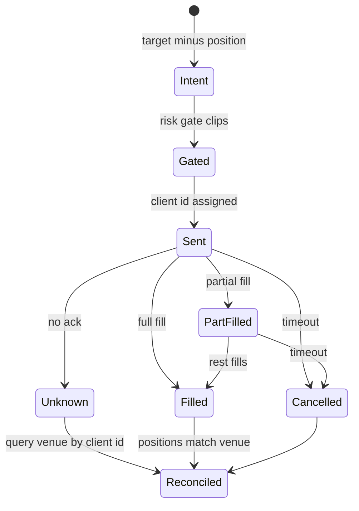

# 07 Execution

## In one paragraph
Execution turns the target portfolio into orders and gets them filled without paying too much. Every trade
costs a fee, the spread and the price move your own order causes; a strategy that trades often with a
small edge can lose money on costs alone. Orders are idempotent so a network retry never doubles a
position, and the exchange's record, not ours, is the truth about what we hold.

## Purpose
Diff the target against current positions, generate orders (reduce-only where they only shrink), route
them to a paper or live venue, record fills with costs, and reconcile against the venue.

## Design rules
1. **Trade the difference between target and position, never the target.** Sending the target again doubles the position.
2. **Every order has a client order id derived from (instrument, decision time).** A retry with the same id cannot create a second order.
3. **Orders that only shrink a position are reduce-only.** A shrink that races a fill can otherwise flip into a new position.
4. **Model every fill with fee, half spread and square-root impact (`pipeline/costs.py`).** Free fills in a backtest are the most common reason live results disappoint.
5. **Cap participation: default 10% of bar volume per order, and no single order larger than the visible depth within 10 bps.** Beyond that, impact grows faster than the model you calibrated.
6. **Default to passive (post-only) orders with a timeout, then cross.** Saves spread and earns maker fees for strategies that can wait; switch to taking for signals that decay within minutes.
7. **Skip trades smaller than a minimum notional.** Tiny rebalances pay fees for no change in risk.
8. **Reconcile positions and balances with the venue every cycle; the venue wins.** Missed fills and partial fills are normal; acting on a wrong position is not.

## Interface
`Executor` and `ExecutionVenue` in [`pipeline/protocols.py`](../pipeline/protocols.py); `OrderIntent`,
`Fill`, `AccountState` in [`pipeline/types.py`](../pipeline/types.py); `CostModel` in
[`pipeline/costs.py`](../pipeline/costs.py). Suite: [`test_execution.py`](../conformance/stages/test_execution.py).

Where in the code: `conformance/toy` (`DeltaExecutor`, `PaperVenue`); the live adapter implements `ExecutionVenue`.

## Crypto specifics
- Maker/taker fees depend on your 30-day volume tier and sometimes on paying in the venue token; read them from the account, not a web page.
- Books in altcoins are thin and can vanish in a crash; size from live depth, not from average volume.
- Rate limits, maintenance windows and stuck "unknown" orders are routine; the client must survive all three.
- Liquidation engines and auto-deleveraging can close your position without an order from you; reconciliation must notice.

## Common failure modes
- **Target sent as order**: position doubles on every rebalance.
- **Retry without idempotency**: duplicate orders after a timeout.
- **Free fills**: backtest Sharpe that collapses after costs.
- **Never reduce-only**: a shrink flips the book short during a fast market.

## Acceptance tests
| id | input -> expected | mutant it kills |
|---|---|---|
| AT-07-1 | equity 10,000, 0.5 A at 100, target 0.2 -> position 20 after orders | `execution_sends_target_not_delta` |
| AT-07-2 | already at target -> no orders | (no churn) |
| AT-07-3 | 30 -> 20 reduce-only; 10 -> 20 not | `execution_never_reduce_only` |
| AT-07-4 | buy and sell 1 at mid 100 -> cost against mid > 0 | `execution_free_fills` |

## Evidence
- **EXP-07-1** backs rule 4. Hypothesis: costs can flip a small, high-turnover edge from positive to negative. Setup: the placeholder strategy and a synthetic signal with a known small edge, hourly rebalancing on synthetic and on public Binance klines. Control: the zero-cost arm. Metric: net Sharpe as cost per trade rises from 0 to 20 bps; break-even cost. Expected: net Sharpe falls with cost and changes sign at a finite break-even. The rule is wrong if net Sharpe does not fall as cost rises (the cost is not being applied). `result: does not support: stricter than the blueprint (whose falls-with-cost condition is met, by construction): synthetic edge annual Sharpe 0.16 (SE 0.45) at 0 bp (realised position IC 0.0017 vs 0.0160 expected), break-even 0.10 bp, -7.58 at 5 bp; BTC planted edge break-even 1.83 bp; toy placeholder on BTC -2.14 gross, -5.29 at 10 bp; seed 71's IC is at the 0% point of 200 seeds (mean 0.0157, sd 0.0054): an unlucky draw`
- **EXP-07-2** backs rule 5. Hypothesis: for orders larger than the top of the book, slicing under a participation cap lowers implementation shortfall, at the price of more timing risk. Setup: synthetic limit order book with a stated depth profile and refill rate; parent orders from 0.1x to 5x top-of-book depth. Control: one market order. Metric: mean and spread of shortfall in bps. Expected: slicing lower mean shortfall for large orders, higher spread. The rule is wrong if the single order is not worse for orders well beyond top-of-book depth. `result: supports: at 5x top depth: sliced 1.48 bp (sd 1.72) vs single 2.80 bp (sd 0); at 0.1x: 1.00 vs 1.00 bp`

## Sources
- Chan, *Quantitative Trading* (2009), ch. 2 (cost components), ch. 3 (costs in backtests), ch. 5 (execution systems, order size versus volume, live-versus-backtest diagnosis).
- Almgren & Chriss (2000), *J. Risk*: optimal execution, impact versus timing risk.
- Almgren, Thum, Hauptmann & Li (2005), *Risk*: square-root impact estimated from data.
- López de Prado (2018), ch. 11 and ch. 14 (costs and implementation shortfall in backtest statistics).
