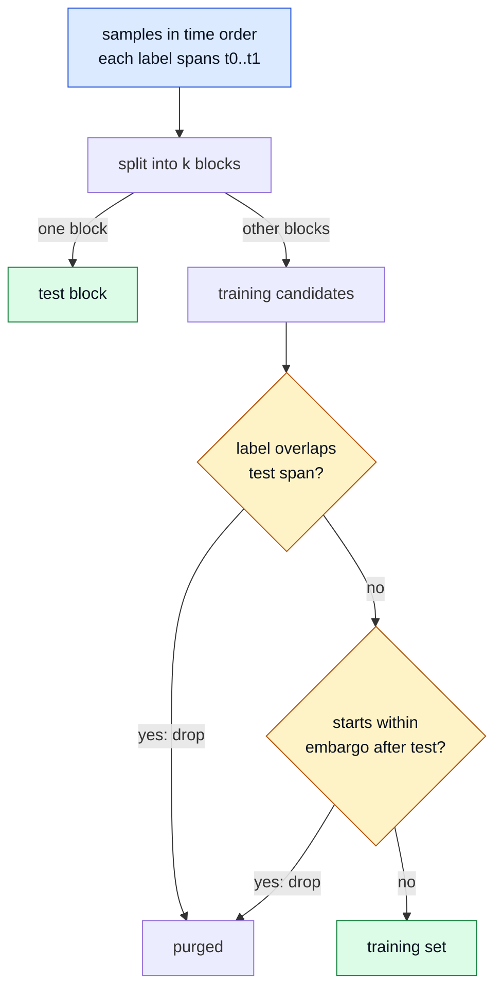

# 08 Validation

## In one paragraph
A backtest always finds something if you try enough ideas. Validation decides whether a result is real or
luck: it tests on data the model never saw, removes the overlap between training and test periods that
silently leaks answers, and discounts the best result by how many ideas were tried to find it. Finally it
checks that paper trading does exactly what the backtest said it would.

## Purpose
Cross-validate without leakage, keep a log of every trial, deflate Sharpe ratios for the search, and
reconcile paper trades against replayed backtest trades before any request to go live.

## Design rules
1. **Use purged k-fold with an embargo; never plain k-fold or a random split.** Labels that span time overlap their neighbours, so a plain split trains on the test answers.
2. **Default embargo: the longest feature lookback or label horizon, whichever is larger.** The leak lasts as long as the overlap does.
3. **Log every trial (parameters, data window, result) before you look at it.** The deflated Sharpe needs the true trial count and the spread of results; forgotten trials make luck look like skill.
4. **Promote only on deflated Sharpe, computed per period with skew and kurtosis.** Raw Sharpe ignores both the search and fat tails.
5. **Fix the promotion rule before the test, and keep a final hold-out you look at once.** A rule chosen after seeing results is another trial.
6. **Report net of costs and funding, with the cost model stated.** A gross result is not a result.
7. **Paper trading must match the backtest replayed on the same data, trade for trade.** Any unexplained difference is a bug until shown otherwise.
8. **Annualise with the real calendar: 365 days, 24 hours.** Equity-market factors (252 days) understate crypto volatility and overstate Sharpe comparisons.

## Interface
`Splitter` in [`pipeline/protocols.py`](../pipeline/protocols.py); `PurgedKFold` in
[`pipeline/cv.py`](../pipeline/cv.py); `sharpe_ratio`, `probabilistic_sharpe_ratio`,
`expected_max_sharpe`, `deflated_sharpe_ratio` in [`pipeline/stats.py`](../pipeline/stats.py).
Suite: [`test_validation.py`](../conformance/stages/test_validation.py).

Where in the code: `pipeline/cv.py` (`PurgedKFold.split`).

## Crypto specifics
- History is short and regimes are few; a decade of data is a handful of cycles, so treat every result as fragile.
- Early years had thin books and different fee levels; a split that tests only on old data flatters.
- Outages and delistings must be in the backtest data, or validation tests a world that did not exist.

## Common failure modes
- **Plain k-fold on overlapping labels**: cross-validated accuracy well above chance on noise.
- **Uncounted trials**: deflated Sharpe looks fine because only the survivors were logged.
- **Repeated hold-out peeks**: the hold-out becomes a training set.
- **Paper drift**: paper P&L differs from the backtest and nobody can say why.

## Acceptance tests
| id | input -> expected | mutant it kills |
|---|---|---|
| AT-08-1 | 200 labels spanning 10 h -> no training interval intersects any test interval | `cv_no_purge` |
| AT-08-2 | test folds disjoint and cover every sample once | (partition) |
| AT-08-3 | embargo > 0, and no training sample starts inside it | `cv_no_embargo` |
| AT-08-4 | SR 0.1, 500 obs: 1 trial equals PSR vs 0; 100 trials clearly lower | `dsr_ignores_trials` |

## Evidence
- **EXP-08-1** backs rules 1 and 2. Hypothesis: on pure noise with overlapping labels, plain k-fold shows false skill and purged k-fold does not. Setup: Gaussian random-walk prices, features from trailing windows, labels = sign of the next 20-bar return (overlapping), a random forest. Control: purged k-fold with embargo. Metric: mean CV accuracy with standard error. Expected: plain above 0.5, purged within noise of 0.5. The rule is wrong if plain k-fold is also within noise of 0.5. `result: supports: accuracy on pure noise: plain shuffled k-fold 0.662 (SE 0.005), contiguous unpurged 0.497 (SE 0.008), purged + embargo 0.495 (SE 0.008)`
- **EXP-08-2** backs rules 3 and 4. Hypothesis: the best of N noise strategies passes a raw Sharpe test and fails the deflated one. Setup: N = 1, 10, 100, 1,000 strategies of iid zero-mean returns, 1,000 repeats. Control: N = 1. Metric: share of repeats where the best strategy has raw PSR > 0.95, and where its DSR > 0.95. Expected: raw false-pass rate rises with N; DSR stays near or below 5%. The rule is wrong if the raw false-pass rate does not rise with N. `result: supports: raw PSR false-pass 5%, 41%, 99%, 100% for N = 1, 10, 100, 1000; deflated 4.8%, 0.0%, 0.0%, 0.3%`

## Sources
- López de Prado, *Advances in Financial Machine Learning* (2018): ch. 7 (purged k-fold, embargo), ch. 11 (backtest errors), ch. 12 (combinatorial purged CV), ch. 14 (backtest statistics, deflated Sharpe).
- Bailey & López de Prado (2012), *J. Risk*: the probabilistic Sharpe ratio. Bailey & López de Prado (2014), *J. Portfolio Management*: the deflated Sharpe ratio.
- Bailey, Borwein, López de Prado & Zhu (2017), *J. Computational Finance*: probability of backtest overfitting.
- Harvey, Liu & Zhu (2016), *Review of Financial Studies*: multiple testing in factor research.
- Chan, *Quantitative Trading* (2009), ch. 3 (look-ahead, data snooping, annualisation) and ch. 5 (paper trading).
- Cryer & Chan, *Time Series Analysis with Applications in R* (2008), ch. 8 (residual diagnostics as a model gate).
