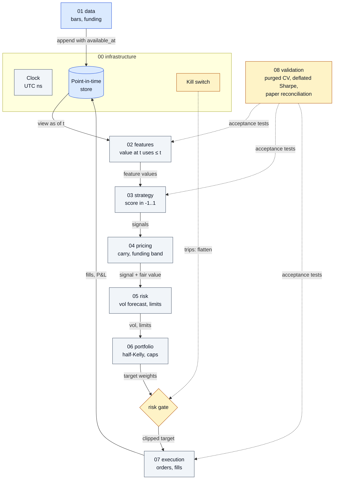

# Blueprint: a crypto trading pipeline, stage by stage

Start with **[FOUNDATIONS.md](FOUNDATIONS.md)**: the sixteen ideas every stage rests on, each with its
formula, the mistake it prevents and the experiment that demonstrates it.

Each stage file below says *why*: its rules, failure modes, acceptance tests, evidence and sources.
The *what* is code: contracts in [`pipeline/protocols.py`](../pipeline/protocols.py), shared building
blocks in [`pipeline/`](../pipeline), and acceptance tests in [`conformance/stages/`](../conformance/stages).
The example strategy is a simple placeholder; nothing here claims a strategy makes money.

Where in the code: `pipeline/store.py`, `pipeline/clock.py`, `pipeline/risk.py`, `pipeline/protocols.py`,
`conformance/stages/`. Validation wraps every stage; the dotted edges show three of them.

## Stages, in build order

| order | stage | answers | contract | suite |
|---|---|---|---|---|
| 1 | [00 infrastructure](00-infrastructure.md) | config, secrets, time, logs, kill switch, paper mode | `pipeline/clock.py`, `pipeline/store.py` | `test_infra.py` |
| 2 | [01 data](01-data.md) | what happened, and when we knew it | `DataSource` | `test_data.py` |
| 3 | [02 features](02-features.md) | stationary inputs computed point-in-time | `Feature` | `test_features.py` |
| 4 | [08 validation](08-validation.md) | is the result real or luck | `Splitter`, `pipeline/stats.py` | `test_validation.py` |
| 5 | [03 strategy](03-strategy.md) | a view, never a size | `Strategy` | `test_strategy.py` |
| 6 | [04 pricing](04-pricing.md) | fair value of futures and perps by carry | `PricingModel`, `pipeline/pricing.py` | `test_pricing.py` |
| 7 | [05 risk](05-risk.md) | how much can this lose, and when do we stop | `RiskModel`, `RiskGate` | `test_risk.py` |
| 8 | [06 portfolio](06-portfolio.md) | how big, given risk and conviction | `PortfolioConstructor`, `pipeline/sizing.py` | `test_portfolio.py` |
| 9 | [07 execution](07-execution.md) | get to the target without paying too much | `Executor`, `ExecutionVenue` | `test_execution.py` |

Validation is built fourth, before any strategy, because a strategy cannot be judged without it.

## Also here

- [EVIDENCE.md](EVIDENCE.md): every experiment that backs a design rule, with its status.
- [../AGENTS.md](../AGENTS.md): how an agent works through the stages, and what it must never do alone.

If a stage file and the code disagree, the code and its tests win; fix the file.
